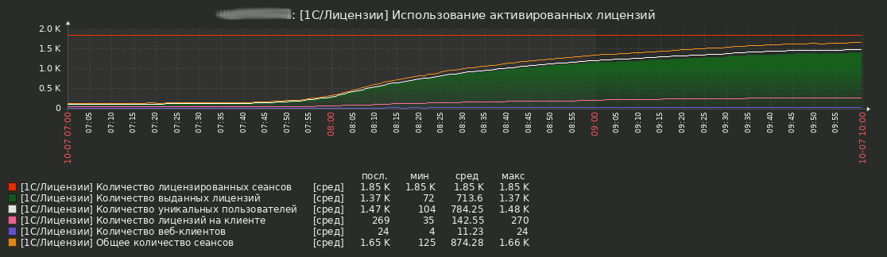

# Сервер лицензирования

Для мониторинга роли **Сервера лицензирования** реализован сбор следующих показателей:
* Общее количество сеансов на серверах кластера, в котором участвует данный сервер лицензирования;
* Количество файлов клиентских лицензий, активированных на данном сервере (только клиентские лицензии ПРОФ и КОРП);
* Количество сеансов лицензируемых клиентскими (программными) лицензиями, активированными на данном сервере;
* Количество сеансов лицензируемых клиентскими лицензиями с пользовательских компьютеров;
* Количество сеансов использующих веб-клиент;
* Количество использованных лицензий (выданных данным сервером);
* Проверка на отключение от кластеров, в которые включен сервер лицензирования.

**СОВЕТ:** Для надежного получения значений по сеансам необходимо на сервере лицензирования увеличить таймаут zabbix-агента в зависимости от количества кластеров, в состав которых входит сервер лицензирования, количества информационных баз и общего количества сеансов. Рекомендуемое значение - **10 сек**.

## Макросы для сервера лицензирования
В шаблоне сервера лицензирования есть следующие макросы:
* **{$RAS_PORTS}** - порт(ы) сервера RAS, для кластера(ов), в котором(ых) данный сервер является центральным (в случае несколькихх значений, они указываются через запятую);
* **{$RAS_TIMEOUT}** - максимальное время ожидание ответа сервиса RAS, указанное в секундах;
* **{$RAS_USER}** - имя пользователя (администратора кластера), необходимое для получения данных от сервиса RAS;
* **{$RAS_PASS}** - пароль пользователя (администратора кластера);
* **{$LIC_UTIL_LIMIT}** - значение отношения количества использованных лицензий к количеству сеансов, лицензируемых клиентскими лицензиями, активированными на данном сервере, по превышении которого срабатывает триггер с предупреждением о скором исчерпании имеющихся лицензий.

## Тригеры
Для отслеживания критичных изменений показателей роли **Сервера лицензирования** созданы триггеры, срабатывающие при следующих событиях:
* Количество лицензий, выданных данным сервером лицензирования, превышает пороговое значение, регулируемое макросом **{$LIC_UTIL_LIMIT}**. Уровень важности - **Предупреждение**;
* Использованы все активированные лицензии, т.е. количество сеансов с лицензией, выданной данным сервером лицензирования, равно количеству клиентских лицензий активированных на данном сервере. Уровень важности - **Высокая**;
* При работе с кластером 1С Предприятия используются локальные пользовательские лицензии (по-умолчанию деактивирован). Уровень важности - **Информация**;
* Количество локальных пользовательских лицензий превышает 50% (по-умолчанию деактивирован). Уровень важности - **Предупреждение**;
* Отключение от кластера, в состав которого включен сервер лицензирования. Уровень важности - **Высокая**.

## Графики
Для визуализации показателей роли **Cервера лицензирования** предусмотрены следущие графики:
* Использование активированных лицензий 

## Правила обнаружения
Для отслеживания использования клиентских лицензий, выдаваемых сервером лицензирования реализованы следующие "разрезы":
* Если сервер лицензирования входит в состав нескольких кластеров 1С Предприятия и требуется сбор данных в разрезе кластров, необходимо активировать соответствующее **правило обнаружения** (по-умолчнию деактивировано). После этого собираемые показатели и графики станут доступными в разрезе кластеров, в которых принимает участие данный сервер лицензирования;
* Если требуется сбор данных в разрезе информационных баз, необходимо активировать соответствующее **правило обнаружения** (по-умолчнию деактивировано). После этого собираемые показатели и графики станут доступными в разрезе всех информационных баз всех кластеров, в состав которых включен данный сервер лицензирования.

## Комплексные экраны
В шаблон сервера лицезирования включены два комплексных экрана:
* Использование активированных лицензий по кластерам;
* Использование активированных лицензий по информационным базам.

Данные экраны строятся автоматически и включают общий график по утилизации лицензий, а так же все графики в контексте выбранного "разреза"

[Назад](../README.md)
